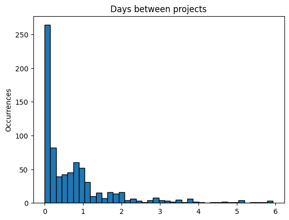
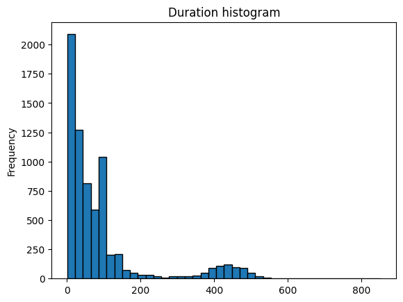
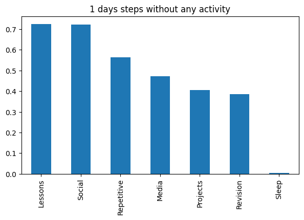
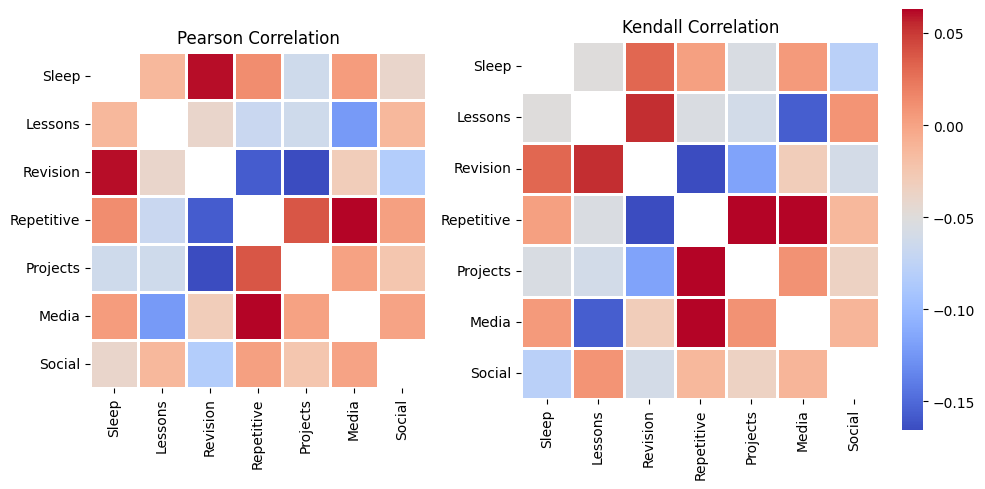

# This notebook

As mentioned in my [doom-emacs repository](https://github.com/tebe-nigrelli/doomemacs-config), I like to collect data on my habits and analyze it using mathematical methods. 

The following page gives an outline for my process. The [full jupyter notebooks](Common%20Agenda%20AnalysisFramework.ipynb) are available for reference, while here I have highlighted some features and results. The code is quite messy and begging to be formatted, which I intend to do some day.

For the time being, I use two notebooks, one to visualise single events, and the other to summary trends.


_TODO include image of the pipeline here_

# Data Collection 

I store most of my data through a customised doom-emacs distribution, which can be accessed [here](https://github.com/tebe-nigrelli/doomemacs-config). 

For example, whenever I watch a movie, I open [Emacs](https://www.gnu.org/software/emacs/tour/) and use my own keyboard shortcuts to quickly store an entry in one of my log files. For the writing format, I use [org-mode](https://orgmode.org/), one of the available plugins for Emacs, which I extended slightly to include the time zone in the time stamps. 

<table border="2" cellspacing="0" cellpadding="6" rules="groups" frame="hsides">

<colgroup>
<col  class="org-left" />
<col  class="org-left" />
<col  class="org-left" />
</colgroup>
<thead>
<tr>
<th scope="col" class="org-left">&#xa0;</th>
<th scope="col" class="org-left">Original</th>
<th scope="col" class="org-left">Extended</th>
</tr>
</thead>
<tbody>
<tr>
<td class="org-left">C fmt</td>
<td class="org-left">[%Y-%m-%d %a %H:%M]</td>
<td class="org-left">[%Y-%m-%d %a %H:%M %z]</td>
</tr>
<tr>
<td class="org-left">org-mode</td>
<td class="org-left"><span class="timestamp-wrapper"><span class="timestamp">[2024-11-04 Mon 09:48 +0100]</span></span></td>
<td class="org-left"><span class="timestamp-wrapper"><span class="timestamp">[2024-11-04 Mon 09:48 +0100]</span></span></td>
</tr>
</tbody>
</table>


The following excerpt shows how a typical entry is stored. Here, the 'Film' subheading, which falls under the tag/category MDI (ie. Media), has a single log, lasting for the time between two time stamps, which amounts to one hour and fifty-five minutes, with 'Dune' as the full entry note.

```
** Film :MDI:
:LOGBOOK:
CLOCK: [2024-10-16 Wed 22:24 +0200]--[2024-10-17 Thu 00:20 +0200] =>  1:56
- Dune
:END:
```

# Exporting

The data is exported to a csv table using [Jeff Filipovits](https://github.com/legalnonsense)'s brilliant [org-csv-export](https://github.com/legalnonsense/org-clock-export) package. It is particularly useful because it was designed to be extensible: users can define functions that retrieve data for each row, adding the results to the export file. The full code is available at [org-clock-export](https://github.com/legalnonsense/org-clock-export) and the file 'org-csv-util.el' of this repository contains my settings.

The following is my export format: I make sure to include position in the log inside the file (outline), tags and any included notes. 

```lisp
'("filename" (file-name-nondirectory (buffer-file-name)) 
  "outline"  (tn/list-to-string (org-get-outline-path t t))
  "date"     (concat start-year "-" start-month "-" start-day)
  "tzone"    (tn/get-tzone)
  "start"    (concat start-hour ":" start-minute)
  "duration" (number-to-string (+ (* (string-to-number total-hours) 60)
                                  (string-to-number total-minutes)))
  "tags"     (or (org-entry-get (point) "ALLTAGS") "nil")
  "note"     (tn/get-lognote))
```

At export, the data looks like this, all the way down for 7184 rows, as of November 3rd 2024.

<table border="2" cellspacing="0" cellpadding="6" rules="groups" frame="hsides">

<colgroup>
<col  class="org-left" />
<col  class="org-left" />
<col  class="org-right" />
<col  class="org-right" />
<col  class="org-right" />
<col  class="org-right" />
<col  class="org-left" />
<col  class="org-left" />
</colgroup>
<thead>
<tr>
<th scope="col" class="org-left">filename</th>
<th scope="col" class="org-left">outline</th>
<th scope="col" class="org-right">date</th>
<th scope="col" class="org-right">tzone</th>
<th scope="col" class="org-right">start</th>
<th scope="col" class="org-right">duration</th>
<th scope="col" class="org-left">tags</th>
<th scope="col" class="org-left">note</th>
</tr>
</thead>
<tbody>
<tr>
<td class="org-left">Calendar.org</td>
<td class="org-left">&ldquo;Projects&rdquo; &ldquo;Quantified-Self-Study&rdquo; &ldquo;Export Report&rdquo;</td>
<td class="org-right">2024-01-05</td>
<td class="org-right">+0100</td>
<td class="org-right">23:00</td>
<td class="org-right">55</td>
<td class="org-left">:2024:PRJ:</td>
<td class="org-left">Computing matrix linear transformation</td>
</tr>
<tr>
<td class="org-left">Calendar.org</td>
<td class="org-left">&ldquo;Projects&rdquo; &ldquo;Quantified-Self-Study&rdquo; &ldquo;Export Report&rdquo;</td>
<td class="org-right">2024-01-05</td>
<td class="org-right">+0100</td>
<td class="org-right">22:15</td>
<td class="org-right">13</td>
<td class="org-left">:2024:PRJ:</td>
<td class="org-left">Simplifying code</td>
</tr>
<tr>
<td class="org-left">Calendar.org</td>
<td class="org-left">&ldquo;Projects&rdquo; &ldquo;Quantified-Self-Study&rdquo; &ldquo;Export Report&rdquo;</td>
<td class="org-right">2024-01-03</td>
<td class="org-right">+0100</td>
<td class="org-right">23:30</td>
<td class="org-right">50</td>
<td class="org-left">:2024:PRJ:</td>
<td class="org-left">Experimenting</td>
</tr>
<tr>
<td class="org-left">Calendar.org</td>
<td class="org-left">&ldquo;Projects&rdquo; &ldquo;Quantified-Self-Study&rdquo; &ldquo;Export Report&rdquo;</td>
<td class="org-right">2024-01-03</td>
<td class="org-right">+0100</td>
<td class="org-right">22:00</td>
<td class="org-right">69</td>
<td class="org-left">:2024:PRJ:</td>
<td class="org-left">R Markov Chain automated improvements</td>
</tr>
</tbody>
</table>

I use primarily the **pandas** Python library to conduct my investigation, as its methods are particularly efficient and straightforward, in addition to having the necessary features. The table with the data is read into a pandas dataframe, which I will use throughout my code.

# Data Cleaning

Data is first filtered and formatted for analysis: it is read and altered minimally, and the user is able to filter entry by features, which are either numerical, string lists or of set type.

## Parsing

As the data is originally in text format, columns are converted into their proper types and added to the dataframe. 

The columns affected are time stamps, which become 'datetime' objects, time durations, made into 'timedelta' objects and tags, which are converted into frozenset types. The latter is Python's immutable version of the tag object: immutability makes the data hashable, so the pandas library can quickly use filter the dataframe.

Typically, methods add results to the dataframe without overwriting existing data, unless it was generated by the function itself. For instance, calling a method will add a column the first time, but calling it again, even with different parameters, will overwrite the column.

In hindsight, I believe that a better choice would have been to produce columns and add them separately, but for the time being the code works to a satisfactory degree, so it does not warrant a rewrite.

## Event Analysis

Some simple properties of the data are generally observed as a preliminary step to analysis. 

For instance, the following picture shows the relation between time spent reading some research paper and the time I started reading them. The code allows me to filter the events, determine their labels and handles plotting and colors automatically.


## Outlier Detection

Outlier events are identified based on deviation from the mean of their duration, which is measured in standard deviations. A critical number of standard deviations is fixed and all values that do not fall within the bounds are considered extreme. 

The following command shows how a mask is typically extracted: in this case I group events by outline, that is, by their heading, in order to only compare similar events. 

> extract_outliers_by_group_mask(df, "outline", "duration_timedelta", 3)

<table border="2" cellspacing="0" cellpadding="6" rules="groups" frame="hsides">

<colgroup>
<col  class="org-right" />
<col  class="org-left" />
<col  class="org-right" />
</colgroup>
<thead>
<tr>
<th scope="col" class="org-right">&#xa0;</th>
<th scope="col" class="org-left">outline</th>
<th scope="col" class="org-right">duration (h)</th>
</tr>
</thead>
<tbody>
<tr>
<td class="org-right">53</td>
<td class="org-left">[Work, Helping-Various]</td>
<td class="org-right">02:30</td>
</tr>
<tr>
<td class="org-right">331</td>
<td class="org-left">[Projects, Thesis-Help, Thesis-Data]</td>
<td class="org-right">02:13</td>
</tr>
<tr>
<td class="org-right">380</td>
<td class="org-left">[Projects, Attimo-Personal-Clocking, Coding]</td>
<td class="org-right">03:00</td>
</tr>
<tr>
<td class="org-right">577</td>
<td class="org-left">[Learning, Series, The Boys]</td>
<td class="org-right">04:38</td>
</tr>
<tr>
<td class="org-right">598</td>
<td class="org-left">[Learning, Series, Better Call Saul]</td>
<td class="org-right">02:30</td>
</tr>
</tbody>
</table>

The reason to group outliers stems from the range of recordings, as some kinds are much longer than other. If one considered all events, activities such as sleep would seem outliers and be removed. I should note that this method is also useful to identify events that were misrecorded, helping to correct faulty data.

## Deltas

Outliers may also be detected from observing the distribution of time between consecutive activities. For instance, if an activity is suspended for months, it should be excluded altogether as it results in unbalanced and incomplete data.



This graph shows that most times project activities are carried out on a regular basis.

## Utilities

The **pandas** and **matplotlib** libraries offer a variety of methods and shortcuts to filter dataframes by the values of their columns, or to visualise data quickly. As some data types I use are not standard, I wrote some methods to help with operations.

## Outline Navigation

Outlines are lists of strings which represent the position of a log inside a file. Consider the following file structure.
```
Heading 1
└─► Subheading 2
└─► Subheading 3
      Log A
      Log B
    │  
    └─► Subheading 4
        Log1
        Log2
```
From the example, _Log A_ will have as outline: ["Heading 1", "Subheading 3"]. Specialised methods are used to select clocks based on which outline criteria they match. For example, _Log A_ and _Log B_ are under "Subheading 3" but not "Subheading 4". The following methods are used:

```python

get_exact_outline_mask(df: pd.DataFrame, outline: list) -> pd.DataFrame

get_any_outline_mask(df: pd.DataFrame, outline: str) -> pd.DataFrame

get_index_outline(df: pd.DataFrame, outline: str, index: int) -> pd.DataFrame:
```

The same is done for tags: events can be selected if their tags are a subset of the desired tags.

```python
get_subset_match_tags_mask(cl: pd.Series, tags) -> pd.Series:
```

### Histograms

I plot single properties such as duration with a personalisable function for ease of use.
> plot_histogram(df["duration"], title="Duration histogram", bins=40)
> 
> 

In the image above, one can see the relation between frequency of recording and duration of the log. The bell-looking distribution to the right is sleep, whereas events at the first peak left show personal activities and the second, lower peak corresponds to lessons, typically lasting 90 minutes.

There are situations where one might want to visualize 2D histograms, so my code includes this functionality:


I should note that the visualisation code accounts for nonstandard types: in the following plot I compare tags, of fronzenset type, to duration, of timedelta type.


# Summary Analysis

As a choice of my study, I typically group logs by time and category, running the scripts only the summarised data.

> Instead of studying N events that happened in a week, I group them and only model their combined duration. This ignores their number and variation by event, instead focusing on the total effect. Doing an activity for 1 hour, 10 times, will look the same as doing it once, for 10 hours.

This is done for practical reasons: to reduce the size of the dataset, and to make the effect of particularly long events uniform. Moreover, I automatically store the summary table to reduce running time, using the file when needed.

## Grouping in time

Logs are first grouped into discrete time chunks: the user picks a "time step size", typically 1 day, 1 week or 1 month, and all events that fall under each time period are summed into the number of minutes dedicated to each activity. 

> Instead of considering N occurrences of an event in each week, I just count the total minutes dedicated to each event type per week. 

This subdivision results in a summary table which is a lot smaller compared to the original data: for instance, a 7 day summary of a full year will amount to only 52 rows, from an original 3000. It should also be noted that choosing very long or very short steps will result in either too few data points or many time chunks which are occupied in full by single events. In both cases, analysis is not very indicative.

## Grouping by category
It should be noted that each event has multiple tags associated to it. Consider the following entry: it has year, type, and location as tag: 2023_2024 for the school year, _LES_ for Lessons, _GER_ as in German and _@aulae_ to refer to classroom 'e'.

```
Filename, Heading, ..., Tags
University.org, "GER", ..., :2023_2024:LES:GER:@aulae:
```

These are the main tags ones I use:
- _SWO_, _SFR_ - sleep (with the distinction of waking up with an alarm or freely)
- _LES_, _REV_, _EXM_ - lessons, revision for university and exams
  - _R_, _E_, _S_: revision, exercises and social (ie. in group)
- _BUR_, _WRK_, _TDY_ - bureaucracy, various work tasks, tidying up
- _PRJ_ - time dedicated to personal projects
- _MDI_ - media such as reading books, watching movies or series

Since events generally have multiple tags, one would want their combined duration, while remaining capable of differentiating between them by tag. For example, I may want to compare only how "REV" and "LES" correlate in time.

My solution is to group events into their total duration, taking every group of tags in the dataset, as this is the natural way of grouping the events with minimal loss of information.

The process results in a summary table which has one column for each unique combination of tags. These columns are empty for most of the time, but they can be combined as needed, based on a desired merging rule.

## Merging by category

The next step in data polishing is to pick the subject of analysis, which determines how the events, which are already grouped by tags, are further merged into categories, thus reducing the number of independent variables.

For instance, an analysis that seeks to obtain a complete understanding of how all activities interact in the agenda will combine them uniformly (ie. "standard" in the example). However, a targeted analysis, such as in the following "study" example, of university study may split some tags into multiple categories, example, where "REV" is split into its "R", "E" and "P". In both cases, grouping is justified because there is very little overlap in how tags are grouped, which prevents double counting. As code, a tag_tree dictionary is used as a simple way to store merge rules.

```
tag_tree = {
    "standard": {
        "Sleep": ["SWO", "SFR"],
        "Lessons": ["LES"],
        "Revision": ["REV", "EXM"],
        "Repetitive": ["BUR", "WRK", "TDY", "ORG", "REP"],
        "Projects": ["PRJ"],
        "Media": ["MDI"],
        "Social": ["CAL", "OUT", "EVE", "DOG"],
    },

    "study": {
        "Theory": ["R"],
        "Exercise": ["E"],
        "Projects": ["P"],
        "Exams": ["EXM"],
        "Lessons": ["LES"],
    }}
```

Following a two-step process may seem inefficient, as events are first merged by tag, and in a second moment combined into a single group. However, this makes it possible to cache results, running multiple analyses from the same summary table, following different perspectives.

Interestingly, merging tags represents a change in paradigm: the user decides which set of tags should be counted in the same basket, and which represents different objects.

## Other methods

In the next sections, I discuss the practicality and insight from using some methods in analysing the data.

It is important to note that events and summaries have different properties and distributions. More precisely, the summary table is composed of rows with multiple data columns, as shown by the following picture, with histograms of how each column is spread.


### Sparsity

Something that I found surprising when first looking at the data is how sparse activities tend to be: I always thought that I would do multiple activities, every day, but for some categories such as those relating to university, most days do not involve any activities. 



The chart above, taking 1 day as the step size, shows activities by how rarely they occupy days. The first column indicates that nearly 70% of days go without lessons. Naturally, this visualisation is susceptible to which time period is considered: in this case all of 2023, and 2024 up to November, over representing summer activities.

### Outliers

There is a constant effort to verify the existence of outliers in the data, as forgetting to insert data or 'over correcting' missing values may produce irregularities, skewing an analysis.

The standard method (z-score normalisation) is used to verify the presence of outliers, and can help in understanding the nature of the data. The following table examplifies a typical output. Here, the values are written as minutes, and it is clear which are plausible and which are highly irregular.

<table border="2" cellspacing="0" cellpadding="6" rules="groups" frame="hsides">

<colgroup>
<col  class="org-right" />
<col  class="org-left" />
<col  class="org-right" />
<col  class="org-right" />
<col  class="org-right" />
<col  class="org-right" />
<col  class="org-right" />
<col  class="org-right" />
<col  class="org-right" />
</colgroup>
<thead>
<tr>
<th scope="col" class="org-right">&#xa0;</th>
<th scope="col" class="org-left">max</th>
<th scope="col" class="org-right">from time</sub></th>
<th scope="col" class="org-right">to time</sub></th>
<th scope="col" class="org-right">Theory</th>
<th scope="col" class="org-right">Exercise</th>
<th scope="col" class="org-right">Projects</th>
<th scope="col" class="org-right">Exams</th>
<th scope="col" class="org-right">Lessons</th>
</tr>
</thead>
<tbody>
<tr>
<td class="org-right">0</td>
<td class="org-left">Theory</td>
<td class="org-right">2024-01-27</td>
<td class="org-right">2024-01-28</td>
<td class="org-right">465</td>
<td class="org-right">45</td>
<td class="org-right">0</td>
<td class="org-right">0</td>
<td class="org-right">0</td>
</tr>
<tr>
<td class="org-right">1</td>
<td class="org-left">Exercise</td>
<td class="org-right">2024-01-30</td>
<td class="org-right">2024-01-31</td>
<td class="org-right">95</td>
<td class="org-right">365</td>
<td class="org-right">0</td>
<td class="org-right">25</td>
<td class="org-right">0</td>
</tr>
<tr>
<td class="org-right">2</td>
<td class="org-left">Projects</td>
<td class="org-right">2024-05-17</td>
<td class="org-right">2024-05-18</td>
<td class="org-right">0</td>
<td class="org-right">39</td>
<td class="org-right">489</td>
<td class="org-right">0</td>
<td class="org-right">90</td>
</tr>
<tr>
<td class="org-right">3</td>
<td class="org-left">Exams</td>
<td class="org-right">2024-01-23</td>
<td class="org-right">2024-01-24</td>
<td class="org-right">385</td>
<td class="org-right">10</td>
<td class="org-right">0</td>
<td class="org-right">183</td>
<td class="org-right">0</td>
</tr>
<tr>
<td class="org-right">4</td>
<td class="org-left">Lessons</td>
<td class="org-right">2024-04-18</td>
<td class="org-right">2024-04-19</td>
<td class="org-right">0</td>
<td class="org-right">0</td>
<td class="org-right">0</td>
<td class="org-right">0</td>
<td class="org-right">600</td>
</tr>
</tbody>
</table>

### Normalisation

In order for some data analysis methods to work properly, numeric data is extracted from the summary table, then each column is normalised so its mean is 0 and its standard deviation is 1 (z-score normalisation). 

The **Pandas** library allows to perform a study, then redisplay the data with the original metadata from the summary table, as the indices in the old and modified table match and can be used to merge the results to their labels.

### Clustering

Consider how each data point in the summary table represents a combination of total times dedicated to each activity within a fixed timeframe:

```
Two data points of step-size '1 day' represent each a combination of times dedicated to every activity.
A 'distance' can be defined between them, to record their relative difference. More complex operations can be built on this, to obtain interesting results.
```

Based on the relative 'similarity' between rows of the summary table, it is possible to group data points into 'clusters'. This can help to interpret different behaviours in the time-steps, such as _productive_ as opposed to _not productive_ during the university period.

After choosing the number of clusters, I prefer to check the relative size of the groups to ensure that a split is somewhat even. It is possible for single distant points to be assigned their own group, which is not useful in Analysis. 

The following gives the spread of 5 clusters over the [standard](#merging-by-category) grouping.
+ Cluster 0 :: 56%, 297 samples
+ Cluster 1 :: 5%, 29 samples
+ Cluster 2 :: 23%, 120 samples
+ Cluster 3 :: 10%, 51 samples
+ Cluster 4 :: 6%, 34 samples

A **dendrogram** is also used at times to get a sense of the relative shape of the clusters: if the tree is balanced (eg. the green one), the cluster is somewhat 'compact', as opposed to having 'tails' or spikes (eg. the red cluster).


I have found that **Agglomerative Clustering** works best in avoiding such extreme cases. In addition, varying the number of clusters can be useful to divide numerous groups into more precise categories depending on the number of points available.

Some automatic methods were also developed to interpret the nature of each cluster:
- _Computing the group mean for each category_: one can calculate the 'average' point in each cluster to get a sense of some typical values. This assumes that the group is convex, which tends to be almost always satisfied in the data, although it is not guaranteed by Agglomerative Clustering.
- _Identifying how each cluster stands out_: given the mean value of each coordinate in a cluster, one can identify extreme values and automatically produce labels with significantly 'high' and 'low' qualities, using a z-score method.

Expanding on the previously mentioned 5 clusters, the following table shows their noteworthy features, taken at a precision of at least _n_=1 standard deviation. The number _n_ is chosen by hand to regulate the number of noteworthy features: as higher numbers will exclude all but the most outstanding qualities.

<table border="2" cellspacing="0" cellpadding="6" rules="groups" frame="hsides">
<colgroup>
<col  class="org-right" />
<col  class="org-left" />
<col  class="org-left" />
</colgroup>
<thead>
<tr>
<th scope="col" class="org-right">&#xa0;</th>
<th scope="col" class="org-left">High</th>
<th scope="col" class="org-left">Low</th>
</tr>
</thead>
<tbody>
<tr>
<td class="org-right">0</td>
<td class="org-left">[&rsquo;Projects&rsquo;]</td>
<td class="org-left">[]</td>
</tr>
<tr>
<td class="org-right">1</td>
<td class="org-left">[&rsquo;Repetitive&rsquo;]</td>
<td class="org-left">[]</td>
</tr>
<tr>
<td class="org-right">2</td>
<td class="org-left">[&rsquo;Sleep&rsquo;, &rsquo;Revision&rsquo;, &rsquo;Media&rsquo;]</td>
<td class="org-left">[&rsquo;Projects&rsquo;]</td>
</tr>
<tr>
<td class="org-right">3</td>
<td class="org-left">[&rsquo;Lessons&rsquo;]</td>
<td class="org-left">[&rsquo;Media&rsquo;]</td>
</tr>
<tr>
<td class="org-right">4</td>
<td class="org-left">[&rsquo;Social&rsquo;]</td>
<td class="org-left">[&rsquo;Sleep&rsquo;]</td>
</tr>
</tbody>
</table>

From the table, it seems that if one considers 5 groups of behaviour, _Projects_ and _Repetitive_ tasks (eg. going to the Post Office) don't reduce significantly the time dedicated to other activities, as opposed to _Lessons_, which reduce _Media_ consumption, for example.

Clustering has the advantage of being nonparametric and nonlinear, making it effective at modelling qualitative properties, though this comes at the cost of a quantitative understanding of the data.

### Distributions in Time

Having identified clusters and their labels, I also like to visualise them in relation to relevant time frames. 

For example, fixing 5 clusters over the [standard](#merging-by-category) division of tags, I can obtain a histogram of how 'days' are spread throughout: _Project_ days focus on Sundays, whereas _Social_ days are preferred on Saturday and Tuesday.


The same can be done over the months, which confirms the correctness of the labels.


### PCA

[Principal Component Analysis](https://youtu.be/FD4DeN81ODY) is an elementary technique which reduces the number of variables needed to represent the data. It is useful to both visualise and understand datasets, assuming they are 'simple' enough.

More technically, PCA identifies the main directions in which the data points are 'spread' - you could imagine the whole set of points as a cloud, with PCA looking for its principal axes, in decreasing order of relevance. After finding these directions, the data is drawn in terms of these directions (ie. as a linear combination of a basis of feature vectors). 


When applying PCA on data with _n_ variables, _n_ principal vectors are found in decreasing order of importance. From the graph, one sees that using only the first three components to describe the data, a high 67% of the variance (spread) is still explained (look at the red line), which makes the reduction useful for some purposes like visualisation. This means that the data will be reduced from _n_ = 8 variables to 3 variables, which are obtained from  a matrix transformation of the original data.

The following image is a 3D plot of PCA applied to the [5 clusters](#clustering) from the previous section. As 67% of total variance is maintained, it is a good representation of the true distribution of the data in the original 7-dimensional space of the data, where columns are specified by the [standard](#merging-by-category) tag_tree entry. The new plot shows each point in terms of the three new PCA component vectors. Moreover, the labels are obtained from the [cluster means method](#clustering) in the previous section.


PCA process is particularly useful if the data is 'simple' enough (ie. features are explained linearly), because it means that some point can be expressed as a weighted sum of properties. 

### Correlations

As clustering does not give a precise sense of how different categories are related, correlation matrices are computed for each component of the data, giving a finer notion of how columns in the summary table relate.

A correlation matrix is a square table of correlation coefficients, representing how two variables tend to agree in size, rated from -1 to +1, depending on whether the value of one tends to be the negative of the other, the same, or totally unrelated, if 0.

The following picture gives a sense of how different activities are correlated: a red value represents that the two activities tend to be high at the same time, whereas a blue value refers to one activity being high when the other is low. In either case, one should observe that correlation tends to be low (0.05), which should be attributed to a lot of hidden variables and unpredictability affecting the result.



I experimented with using more kinds of correlations: Pearson, which is susceptible to outliers, and Kendall, more robust to extreme cases. This can be seen in _Sleep_ and _Revision_ appear drastically different due to the presence of outliers; ie. points with either a lot of lessons and a lot of revision, which skew the whole statistic.

In my study of the correlations, I also observed correlations between present and future values, answering the question, "If I do a lot of one thing now, how much more do I do another thing later?". One weakness of this method is to be symmetric, not distinguishing between high now and low later and low now and high later. Still, it is interesting to see some interpretable results: a lot of _projects_ will reduce _media consumption_.


### Markov Chains

A _Transition Matrix_ is a square matrix of probabilities that measures the rate of transition from some state [i] to a state [j] in some time period. In my [case](#clustering), I can construct a matrix which summarises the likelihood of switching from a day of 'University' activities to one of 'Projects' or 'Social'.

Using a fixed step size, it is possible to estimate the probability of going from cluster A to B, adding up all the times a transition happened. This method is used to construct the coefficients of the matrix.


The object may be observed directly, or it can be interpreted as a [Markov Chain](https://en.wikipedia.org/wiki/Markov_chain) process. More specifically, a transformation that acts on a vector of probabilities (ie. where an entry i represents the probability of being in the cluster i) and produces a new vector representing the probabilities at the next time step.

Since the probabilities are calculated numerically, one can assume that the matrix is regular enough (ie. ergodic), and compute the eigenvector associated to eigenvalue 1, which will give a probability vector serving as a stable point. 

Coming back to the real world, this method takes a given allocation of activities (ie. clusters) and predicts the distribution in the next moment. Consider the problem of finding the point of optimal productivity. If you push yourself beyond it, your productivity in the next day will be lower. The following text gives the optimal division of tasks that can be maintained indefinitely.

```
Stable Distribution:
Projects - 0.30443171, 
Repetitive - 0.07481842, 
Revision - 0.30414416, 
Lessons - 0.21057073, 
Social - 0.10603498.
```

### Energy Function

I eventually asked myself whether combinations of activities in a time step could be described in terms of an 'energy budget'. For instance, doing 'costly' activities such as _Revision_ would reduce the energy for other costly activities such as _Projects_, while regenerative activities such as _Media_ consumption would add energy.

I considered the simplest model: using a vector of costs _c_, define energy of a vector $x$ of activities in the time step as $E(x) := c\cdot x$. The choice of optimal $c$ would result from the minimisation of the mean spread of the energy value, over all recordings: 

$$c := \text{argmin}_{c \in \mathbb{R}^n} \mathbb{E}\left[\text{Var}(c \cdot x)\right]$$

The reasoning behind this formula is that the 'Energy' value should be as close to constant as possible (it would not be a good definition otherwise). Moreover, depending on time of the year, it is reasonable to assume that energy dynamics change. For example, what is typically done to rest or for fun during the exam period is fundamentally different from summer of during lessons, so any energy calculations should be contextualised. 

The following heatmap proposes multiple cost vector for the university period, ranking them by variance and showing the histogram for $c\cdot x$ at the right.


At a fundamental level, it is unclear to pick the best cost vector because the true uncertaintay of the data is not known. This is also related to linear models performing poorly on the data: there is too much randomness in the features and how they are distributed.

The following matrix shows the best cost vectors by time period. It should be noted that sign has no absolute meaning, as vectors $c$ and $-c$ produce the same result.


On a final note, energy methods fail to capture nonlinear effects: activities twice as long will be considered twice as 'costly'. There is also a deep ambiguity in what is generally done and what is exhausting to do: just being signed up for class does not guarantee paying attention, hence being drained by the energy expense.


# Extensions

In its current state, the code has a lot of useful features that can be used to analyse the data, or as a basis for other data analysis methods, but it requires interactive development within Jupyter.

I had plans to bundle the code into a flexible script that would allow users to 'order' a certain output, whether data, a report, or a visual graph. The program would identify all the intermediate steps needed to compute the results, and save them to memory, while generating the output, to reduce its average running time. 

Although the idea was scrapped due to its complexity and time requirements, I would still like to revise the project in the future. For instance, I would like to have a script that automatically compiles yearly reports on my habits and productivity. 

These days, most of my time is spent developing [Attimo](https://github.com/quercia-dev/Attimo/), a free and open source productivity tool. 